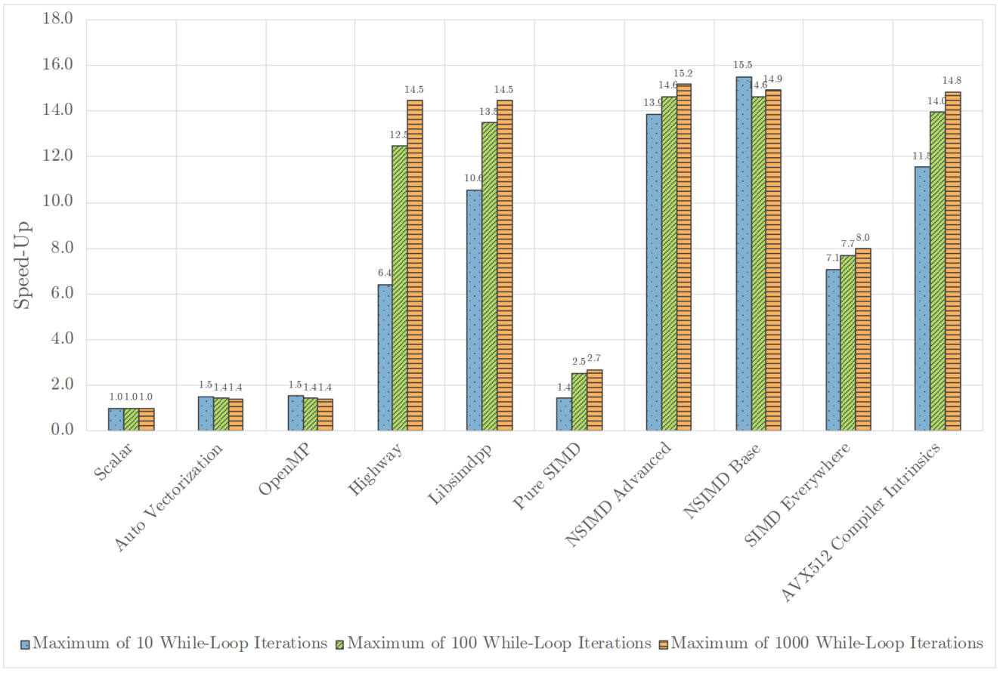

-----

| Title     | OPT PARA SIMD                                        |
| --------- | ---------------------------------------------------- |
| Created @ | `2023-07-26T07:07:32Z`                               |
| Updated @ | `2023-07-27T01:46:08Z`                               |
| Labels    | \`\`                                                 |
| Edit @    | [here](https://github.com/junxnone/xwiki/issues/286) |

-----

# SIMD

  - [SIMD Hardware](/0007_Hardware_SIMD)

## C++ LIB

  - Auto Vectorization
  - OpenMP
  - Highway
  - Vc
  - Libsimdpp
  - Pure SIMD
  - NSIMD Advanced
  - NSIMD Base
  - SIMD Everywhere
  - AVX2 Intrinsics

## Reference

  - [Evaluation of CPP SIMD
    LIB](https://github.com/junxnone/xwiki/blob/main/docs/reference/Evaluation%20of%20CPP%20SIMD%20LIB.pdf)
