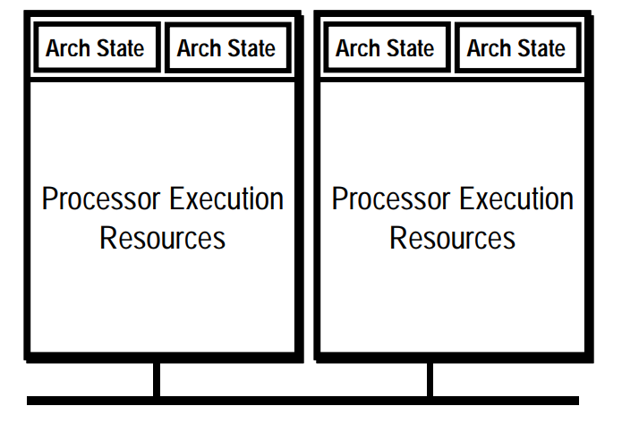

-----

| Title     | Hardware CPU HT                                      |
| --------- | ---------------------------------------------------- |
| Created @ | `2023-10-30T08:24:55Z`                               |
| Updated @ | `2023-10-30T08:28:05Z`                               |
| Labels    | \`\`                                                 |
| Edit @    | [here](https://github.com/junxnone/xwiki/issues/295) |

-----

# Hyper-Threading 超线程

  - SMT - `Simultaneous Multi-Threading`
  - Architectural State `x2`
      - General-purpose Registers
      - Control Registers
      - APIC Registers
      - Machine state Registers
  - Execution Resources `x1`

## Reference

  - [Hyper-threading -
    wikipedia](https://en.wikipedia.org/wiki/Hyper-threading)
  - [hyper-threading.pdf](https://github.com/junxnone/xwiki/files/13202670/hyper-threading.pdf)
